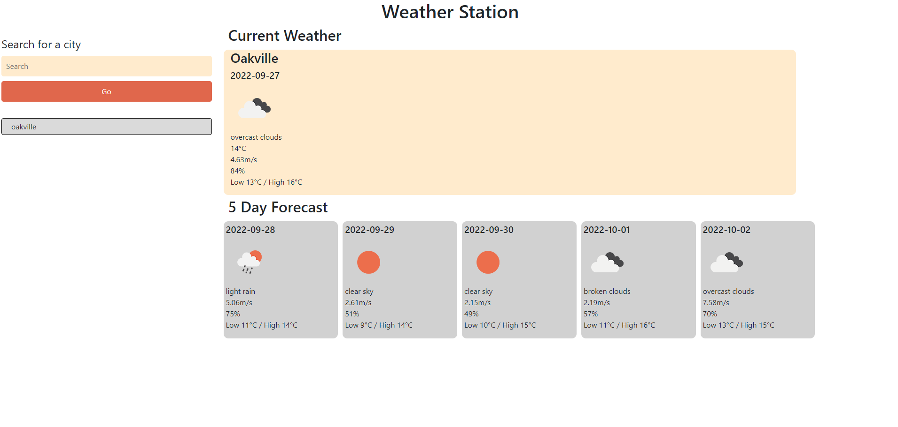

# Weather Station

## Description

A weather station website that can be used to plan ahead by looking up weather for a specific city. It will return the current weather as well as a 5 day forecast

## Installation

No installation required. To use the site navigate to https://michaelsinn.github.io/weather-station/

## Usage

To use the website, simply enter the name of the city you wish to search for into the search bar and press go. In order to see a previous searched city, simply click on its entry in the history.
If you wish to be more specific you can add more information with commas in the format: "City, State Code, Country Code". Otherwise, simply input the name of the city.

## Credits

Michael Sinn - https://github.com/MichaelSinn

## License

MIT License

Copyright (c) [year] [fullname]

Permission is hereby granted, free of charge, to any person obtaining a copy
of this software and associated documentation files (the "Software"), to deal
in the Software without restriction, including without limitation the rights
to use, copy, modify, merge, publish, distribute, sublicense, and/or sell
copies of the Software, and to permit persons to whom the Software is
furnished to do so, subject to the following conditions:

The above copyright notice and this permission notice shall be included in all
copies or substantial portions of the Software.

THE SOFTWARE IS PROVIDED "AS IS", WITHOUT WARRANTY OF ANY KIND, EXPRESS OR
IMPLIED, INCLUDING BUT NOT LIMITED TO THE WARRANTIES OF MERCHANTABILITY,
FITNESS FOR A PARTICULAR PURPOSE AND NONINFRINGEMENT. IN NO EVENT SHALL THE
AUTHORS OR COPYRIGHT HOLDERS BE LIABLE FOR ANY CLAIM, DAMAGES OR OTHER
LIABILITY, WHETHER IN AN ACTION OF CONTRACT, TORT OR OTHERWISE, ARISING FROM,
OUT OF OR IN CONNECTION WITH THE SOFTWARE OR THE USE OR OTHER DEALINGS IN THE
SOFTWARE.